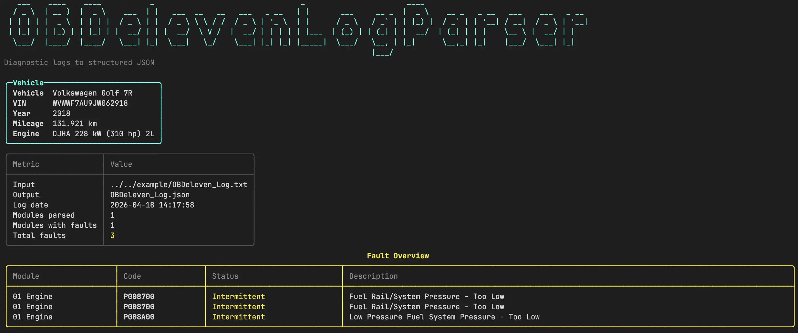

# OBDeleven Log Parser

Got a check engine light. Wrote a parser. You know how it goes.

This is a minimal .NET 10 console app that takes an OBDeleven diagnostic log export and turns it into structured JSON — typed fields, no magic strings, ready to pipe into whatever you want.



## Usage

Parse a log and print JSON to stdout:

```bash
dotnet run -- --input path/to/OBDeleven_Log.txt
```

Write the JSON to a file instead of stdout:

```bash
dotnet run -- --input path/to/OBDeleven_Log.txt -o OBDeleven_Log.json
```

Options can be written in long, short, or equals form:

```bash
dotnet run -- -i path/to/OBDeleven_Log.txt --output OBDeleven_Log.json
dotnet run -- --input=path/to/OBDeleven_Log.txt --output=OBDeleven_Log.json
```

The input path can also be positional:

```bash
dotnet run -- path/to/OBDeleven_Log.txt
dotnet run -- path/to/OBDeleven_Log.txt -o OBDeleven_Log.json
```

If no input path is provided, the app looks for `OBDeleven_Log.txt` in the current directory.

## Tests

```bash
dotnet test
```

Verbose output if something looks off:

```bash
dotnet test --logger "console;verbosity=detailed"
```

## Output

```json
{
  "LogDate": "2026-04-18T14:17:58",
  "Vehicle": {
    "Vin": "...",
    "Car": "Volkswagen Golf R",
    "Year": 2018
  },
  "Modules": [
    {
      "Id": "01 Engine",
      "SystemDescription": "R4 2.0l TDI",
      "Faults": [
        {
          "Code": "P008700",
          "Description": "Fuel Rail/System Pressure - Too Low",
          "Status": "Intermittent",
          "Snapshot": { "Priority": 2, "EngineRpm": 436, "CoolantTempC": 20 }
        }
      ]
    }
  ]
}
```

## Requirements

- .NET 10 SDK
- OBDeleven log file exported from the [OBDeleven app](https://obdeleven.com)

## Background

Full write-up on how this was built and what I learned along the way: [ikranjec99.github.io/blog/obdeleven-log-parser](https://ikranjec99.github.io/blog/obdeleven-log-parser/)
